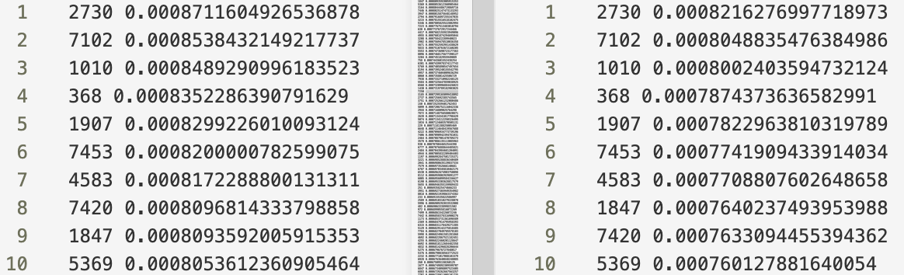
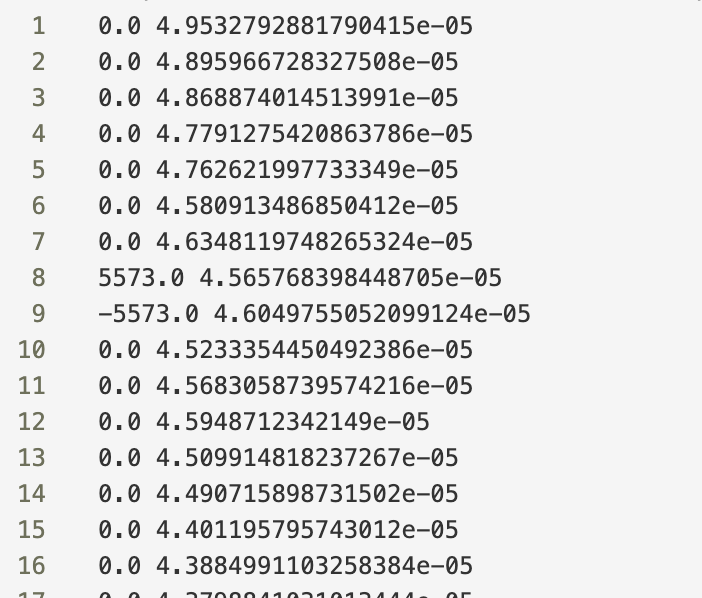
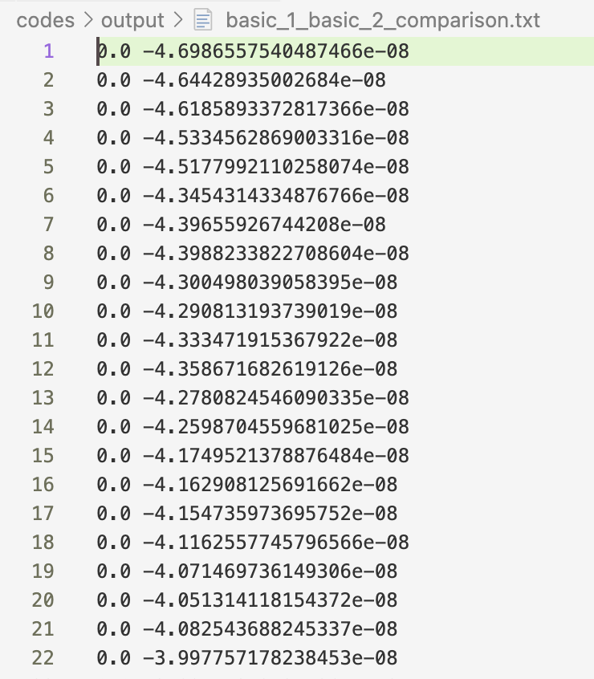
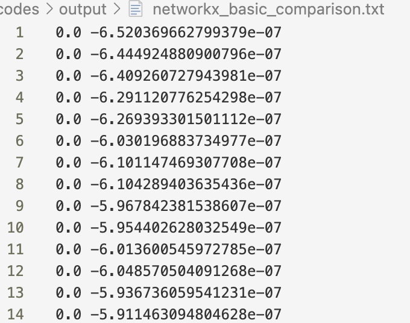

# <center>大数据计算及应用实验报告</center>

 <center>Lab1 PageRank</center>

| 2112492 | 2112338 | 2213924 |
| :-----: | :-----: | :-----: |
| 刘修铭  | 李威远  | 申宗尚  |

## 题目

对于给定数据集，给出基于 PageRank 分数的前 100 个节点，并尝试不同的参数。必须给出阻尼因子为 0.85 时的结果数据。

除了基本的 PageRank 算法外，还需要完成 Block-Stripe Update 算法。


## 实验要求

* 实现 PageRank 算法，考虑 dead ends 和 spider trap 节点
* 优化稀疏矩阵，提高算法性能
* 实现分块计算，提高计算效率
* 程序需迭代至收敛
* 不可直接调用接口
* 结果格式（.txt 文件）：[NodeID] [Score]

​	

## 实验数据分析

本次实验数据，有向图共有 6110 个 from_node，而所有的节点数为 8297个，由此可见，生成的转移矩阵中存在大量无效数据（0），为后续优化存储提供条件。

共有 6110 个节点出度不为 0，说明存在大量节点只入不出，因此算法实现时需要着重考虑该部分节点。


## 实验原理

### PageRank 算法解释

Pagerank 算法是一种用于评估网络中节点重要性的算法，Pagerank 值反映了一个网页被其他网页链接的数量和质量，即被其他网页认为重要的程度。

Pagerank 算法的核心原理基于以下两个假设： 

1. **链接数量假设：** 如果一个网页被很多其他网页链接，那么这个网页可能更重要。这是因为其他网页选择链接到该网页，表明它们认为这个网页的内容或信息是有价值的。
2. **链接质量假设：** 如果一个重要的网页链接到另一个网页，那么被链接的网页可能也很重要。这是因为重要网页的链接可以被视为一种背书，即它们在某种程度上认可被链接网页的内容或信息。

Pagerank 算法通过迭代计算节点的 Pagerank 值来实现。它将网页排名问题转化为一个概率传递问题，其中网页的排名被视为概率分布。算法的基本思想是将网络中的节点视为**随机游走者**，在每一步中，游走者以一定的概率按照链接关系跳转到其他节点。Pagerank 值最终被定义为游走者在长期随机游走后到达每个节点的概率。 

算法的基本公式为：
$$
PB(u)=\sum_{v \in B_u} \frac{PR(v)}{L(v)}
$$
其中，$PB(v)$ 代表指向 $u$ 节点的其他节点的 PR 值，$L(v)$ 代表指向 $u$ 节点的其他节点的出度数。初始的时候，每个节点被初始化为 $\dfrac{1}{N}$，$N$ 为节点总数。接着迭代计算，即可求出每个节点的 PageRank 分数。在计算时，通常使用马尔可夫矩阵。使用 M 表示当前 PR 值的矩阵表示，V 表示上一次得到的 PR 值，二者相乘即可得到新的 PR 值。由此不断计算迭代即可。

但是在原始 PageRank 算法中，存在两种特殊节点：dead end 和 spider trap 节点。

* dead end 节点：即，有的节点没有出度，只有入度，会导致 PageRank 变为 0。该问题的解决方案如下：
  1. **随机跳转**：在计算 PageRank 时，引入随机跳转概念。即当一个页面是 dead end 时，随机跳转到其他页面，使得流量能够继续流动，避免了流量损失。这种方法模拟了一个随机的用户行为，增加了网络的连通性。
  2. **人为增加链接**：对于存在 dead end 的页面，可以人为地增加链接，将其链接到其他页面上。这样可以增加页面之间的联系，提高网络的连通性，从而改善 PageRank 的计算结果。
  3. **重新调整转移概率**：在计算 PageRank 时，可以重新调整转移概率，使得即使在存在 dead end 的情况下，页面之间的流量仍然能够流动。可以根据实际情况，对转移概率进行重新分配，以减少 dead end 的影响。
  4. **添加虚拟链接**：对于存在 dead end 的页面，可以添加虚拟链接，将其链接到网络中的其他页面上。这样可以增加页面之间的链接关系，提高网络的连通性，从而改善 PageRank 的计算结果。

* spider trap 节点：部分节点之间形成了一个循环链接，导致在访问这些页面时陷入无限循环，无法终止，最终该部分节点的 PageRank 值趋向为 1，其余逐渐变成 0。该问题的解决方案如下：
  1. **随机跳转**：在计算 PageRank 时，引入随机跳转概念。当遇到 spider trap 时，可以模拟随机用户的行为，随机跳转到其他页面，避免陷入循环链接的无限循环。
  2. **人为干预**：手动调整页面之间的链接结构，断开循环链接，或者在循环链接中添加 nofollow 标签，告知不要跟踪这些链接。
  3. **使用概率调整**：在计算 PageRank 时，对链接转移概率进行调整，以避免陷入循环链接的情况。根据实际情况，对具有循环链接的页面的转移概率进行调整，使得能够正确地跳出循环链接。

基于上述讨论，给出算法的修正公式：
$$
PR(u) = \frac{1 - \alpha}{N} + \alpha \sum_{v \in B_u} \frac{PR(v)}{L(v)}
$$
其中，$\alpha$ 被称为阻尼因子，表示一个随机用户按照链接随机浏览页面的概率。通常情况下，$\alpha$ 取值约为0.85，这意味着有 85% 的概率随机用户会继续点击页面上的链接，而 15% 的概率会随机跳转到其他页面。

### PageRank 计算方法

#### 迭代法

迭代法即为不断迭代，直到相邻两次的差值达到设定阈值为止。此处使用向量和矩阵对前面的公式进行进一步推导，并最后得到适用于编程的公式。

对于各个节点的 PageRank 计算矩阵，使用符号进行表示：
$$
P_{n+1} = \alpha SP_n+\dfrac{1-\alpha}{N}e^T
$$
提取常数项，得到常数矩阵 A：
$$
A=\alpha S+\dfrac{1-\alpha}{N}ee^T
$$
则 PageRank 的计算公式如下：
$$
P_{n+1} = AP_n
$$
基于此公式即可进行迭代计算。

#### 代数法

基于 PageRank 算法的收敛特性，可以得到如下公式：
$$
P = \alpha SP+\dfrac{1-\alpha}{N}e^T
$$
即：
$$
P=(E-\alpha S)^{-1}\dfrac{1-\alpha}{N}e^T
$$
由此，求出矩阵的逆即可完成对 PageRank 分数的求解。

### PageRank 算法优化方向


## 实验过程（含关键代码解析）

### 原始 PangeRank 算法

1. 首先定义了 `read_graph` 函数，将给定的数据文件读取为有向图的形式，并提取出所有的节点到集合  `nodes` 中。

   ```python
   def read_graph(file_path):
       G = {}
       nodes = []
       with open(file_path, 'r') as f:
           for line in f:
               from_node, to_node = map(int, line.strip().split())
               if from_node not in G:
                   G[from_node] = []
               G[from_node].append(to_node)
               if from_node not in nodes:
                   nodes.append(from_node)
               if to_node not in nodes:
                   nodes.append(to_node)
       return G, nodes
   ```

2. 接着定义了 `output_result` 函数，用于将提取出的数据按照格式要求写入到输出文件中。

   ```python
   def output_result(results, file_path):
       with open(file_path, 'w') as f:
           for node, score in results:
               f.write(f"{node} {score}\n")
   ```

3. 下面对 PageRank 核心计算部分进行解释。

   * 首先对于前面提取出的节点集合进行处理，按照节点的序号进行排序标号，得到其索引集合，便于后续处理。

     ```python
     index = {}
     for i, node in enumerate(sorted(nodes)):
         index[node] = i
     ```

   * 接着按照前面构建的有向图，结合构建的索引，构建转移矩阵 S。

     ```python
     S = np.zeros([N, N], dtype = np.float64)
     for from_node, to_nodes in G.items():
         for to_node in to_nodes:
             S[index[to_node], index[from_node]] = 1
     ```

   * 然后对 S 进行初始化。此处实现时考虑了 dead end 和 spider trap 问题。

     ```python
     for j in range(N):
         sum_of_col = sum(S[:, j])
         if sum_of_col == 0:
             S[:, j] = 1 / N
         else:
             S[:, j] /= sum_of_col
     ```

   * 按照前面**<u>实验原理</u>**中解释的方法对其进行计算。下面将按照不同的方法对其分别进行解释。

   * 最后基于前面得到的 PageRank 值，排序后，使用索引输出最后结果。

     ```python
     sorted_nodes = sorted(index.items(), key = lambda x: P_n[x[1]], reverse=True)
     
     sorted_results = []
     for node, index in sorted_nodes[:100]:
         sorted_results.append((node, P_n[index]))
     ```

#### 迭代法实现

首先构建常数矩阵 A。

```python
A = teleport_parameter * S + (1 - teleport_parameter) / N * np.ones([N, N], dtype = np.float64)
```

接着初始化两个矩阵、误差以及阈值用于后续迭代计算。

```python
P_n = np.ones(N, dtype = np.float64) / N
P_n1 = np.zeros(N, dtype = np.float64)
e = 100
tol = 1 / (N * N)
```

最后使用循环进行迭代计算，当误差在阈值允许的范围内即停止。

```python
while e > tol:
    P_n1 = np.dot(A, P_n)
    e = P_n1 - P_n
    e = max(map(abs, e))
    P_n = P_n1
```

#### 代数法实现

首先创建两个矩阵，一个为大小为 $N\times N$ 的单位阵，另一个为大小为 $N\times1$ 的列向量。

```python
e = np.identity(N, dtype = np.float64)
eT = np.ones([N, 1], dtype = np.float64)
```

接着按照前面推导的公式，求解出 PageRank 值。

```python
P = np.dot(np.linalg.inv(e - teleport_parameter * S), ((1 - teleport_parameter) / N * eT)).flatten()
```

### PageRank 算法优化


### 第三方库实现

为了对自己编写的算法进行评估分析，小组使用第三方库 NetworkX 完成了 PageRank 算法的实现。

* `read_graph` 函数：该函数用于从给定的文件中读取图数据，其中读取部分基于给定的文件格式实现。使用 NetworkX 提供的 `DiGraph` 类创建一个有向图对象。遍历 `Data.txt` 文件，解析出每条边的起始节点和结束节点，并将其添加到有向图中。

  ```python
  import networkx as nx
  def read_graph(file_path):
      G = nx.DiGraph()
      with open(file_path, 'r') as f:
          for line in f:
              from_node, to_node = map(int, line.strip().split())
              G.add_edge(from_node, to_node)
      return G
  ```

* `calculate_pagerank_and_sort` 函数：计算图中每个节点的 Pagerank 值，并按值从大到小排序。调用 NetworkX 提供的 `pagerank` 函数来计算 Pagerank 值。NetworkX 库提供的 `pagerank` 函数可以设置阻尼因子、收敛阈值等参数。本次实验中，小组设置阈值为 $\dfrac{1}{N\times N}$ 和不设置阈值分别运行，得到两套数据用于分析对比。计算完成后，筛选得分前 100 名的节点输出到文件中。（此处以设置阈值为 $\dfrac{1}{N\times N}$ 版本为例进行展示）

  ```python
  def calculate_pagerank_and_sort(G, teleport_parameter=0.85, tol=1e-20, top_n=100):
      pagerank_scores = nx.pagerank(G, alpha=teleport_parameter, tol=tol)
      sorted_scores = sorted(pagerank_scores.items(), key=lambda x: x[1], reverse=True)
      return sorted_scores[:top_n]
  ```

* `output_result` 函数：将排序后的 Pagerank 结果输出到文件。

```python
def output_result(results, file_path):
    with open(file_path, 'w') as f:
        for node, score in results:
            f.write(f"{node} {score}\n")
```

### 数据对比

为了方便数据对比，小组编写了一个简单的算术程序，将两个输出文件逐行逐项进行做差，并将结果输出到新的 txt 文件中。程序代码如下：

```python
import os

def compare_files(file1_path, file2_path):
    file1_name, file1_ext = os.path.splitext(os.path.basename(file1_path))
    file2_name, file2_ext = os.path.splitext(os.path.basename(file2_path))
    
    output_file_name = f"{file1_name}_{file2_name}_comparison{file1_ext}"
    output_file_path = os.path.join(os.path.dirname(file1_path), output_file_name)

    with open(file1_path, 'r') as f1, open(file2_path, 'r') as f2, open(output_file_path, 'w') as output_file:
        for line1, line2 in zip(f1, f2):
            num1_1, num1_2 = map(float, line1.strip().split())
            num2_1, num2_2 = map(float, line2.strip().split())
            result1 = num1_1 - num2_1
            result2 = num1_2 - num2_2

            output_file.write(f"{result1} {result2}\n")

if __name__ == "__main__":
    file1_path = "./output/networkx.txt"
    file2_path = "./output/basic.txt"

    compare_files(file1_path, file2_path)
```


## 实验结果及分析

基于第三方库 NetworkX 实现的 PageRank 算法得到的结果位于 `./codes/output/networkx.txt` 和 `./codes/output/networkx_withouttol.txt` 中。对比这两个文件，可以看到，节点的排名完全相同，但由于收敛阈值的不同，每个节点的最后得分略有不同，但相差无几。

此处以前十名为例进行展示，可以看到，排名基本相同，但分数略有不同。



如图为对应排名与分数相减后的结果。



使用迭代法与代数法得到的两种结果如下，可以看到，节点的排名完全相同，且分数误差数量级较小，在合理范围内。



将自己实现的 PageRank 算法与添加阈值的使用第三方库实现的进行对比，可以看到，排名完全相同，但分数相差数量级较小，在合理范围内，说明小组编程实现的正确性。




## 实验总结与感悟

本次实验中，小组编程实现了 PageRank 算法，并对其进行了**<u>乌拉乌拉乌拉乌拉乌拉乌拉乌拉乌拉乌拉乌拉乌拉乌拉乌拉乌拉乌拉乌拉乌拉乌拉乌拉乌拉乌拉乌拉乌拉乌拉乌拉乌拉乌拉乌拉乌拉乌拉乌拉乌拉乌拉乌拉乌拉乌拉乌拉乌拉乌拉乌拉乌拉乌拉乌拉乌拉乌拉乌拉乌拉乌拉乌拉乌拉乌拉乌拉乌拉乌拉乌拉乌拉乌拉乌拉乌拉乌拉乌拉乌拉乌拉乌拉乌拉乌拉乌拉乌拉乌拉乌拉乌拉乌拉乌拉乌拉乌拉乌拉乌拉乌拉乌拉乌拉乌拉乌拉乌拉乌拉乌拉乌拉乌拉乌拉乌拉乌拉乌拉乌拉乌拉乌拉乌拉乌拉乌拉乌拉乌拉乌拉乌拉乌拉乌拉乌拉乌拉乌拉乌拉乌拉乌拉乌拉乌拉乌拉乌拉乌拉乌拉乌拉乌拉乌拉乌拉乌拉乌拉乌拉乌拉乌拉乌拉乌拉乌拉乌拉乌拉乌拉乌拉乌拉乌拉乌拉乌拉乌拉</u>**等多个方面的优化。经过与第三方库得到的结果进行对比，可以看到小组实现的效果较好，PageRank 算法的实现度较高。


## 参考
[https://blog.csdn.net/apollo_miracle/article/details/117563650](https://blog.csdn.net/apollo_miracle/article/details/117563650)

[https://blog.csdn.net/qq_41427834/article/details/110262036](https://blog.csdn.net/qq_41427834/article/details/110262036)


## 说明

本次实验代码均位于 `./codes` 文件夹中。
